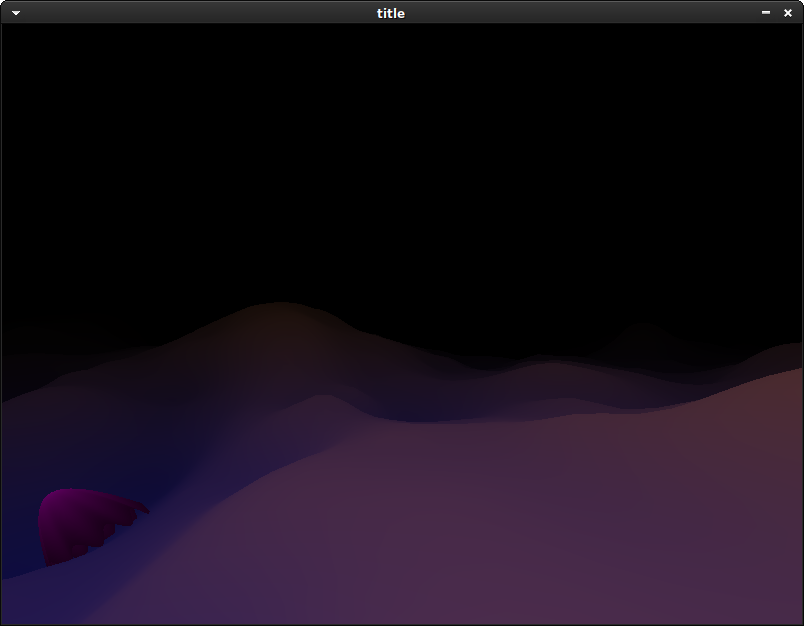

# My first OpenGL game

This is the first project I have created with OpenGL, but not my first 3D game.
My previous games do the 3D drawing on the CPU with pixel-by-pixel for loops.

Running the game:

	$ sudo apt install git g++ make libsdl2-dev libglew-dev
	$ git clone https://github.com/Akuli/opengl-game-experiment
	$ cd opengl-game-experiment
	$ make -j2
	$ ./game

If your graphics card drivers don't support new enough opengl,
you can use software rendering instead, but this will lead to
100% CPU usage and a low FPS:

	$ MESA_LOADER_DRIVER_OVERRIDE=llvmpipe ./game
